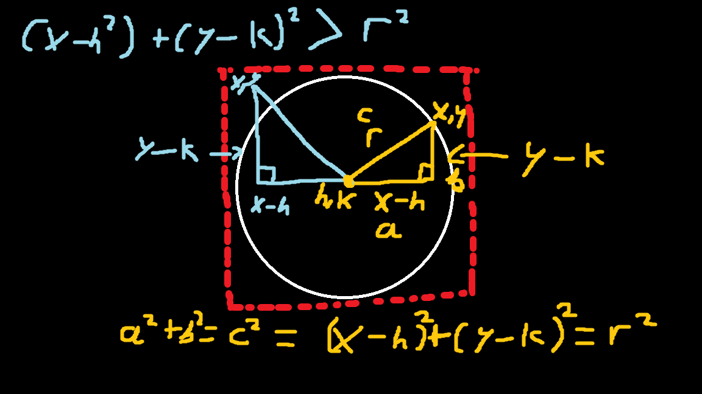

# Ray Caster

## Overview

Ray Casting technique done in SDL2

## How to use

Click and drag anywhere on the screen to move the light source and see the rays interact with the moving object.

## Motivation

I was curious about how ray tracing is done and came across ray casting and thought it would be cool to implement. Done in C solely for the sake of using C.

## 3rd Party Tools / APIs
- SDL2

## Prerequisites
It's assumed that you have the following prior to running the application:
- CPP Compiler
- Visual Studio
- CMake
- SDL2
---

## How To Run

Download SDL2 VC and then extract it into the libs folder, make sure to follow the CMake folder paths.
cd to the build folder and then run:
- cmake ..
- cmake --build .
This will build the .exe which you can then run.
The application should run fine, if there issues running the project contact me via email.

## Graphics

### Circle drawing calculations

A point (X,Y) is taken and then the equation of the line from point (H,K) to (X,Y) is calculated. If this is greater than the equation of line from (H,K) to any point on the circumference then it must be outside the scope of the circle and will not be drawn.
---
